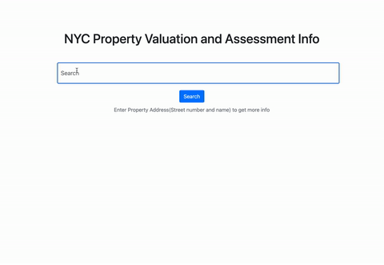

# NYC Property Valuation React APP

## :video_camera: APP Demo

## Link to heroku app
https://nyctax.herokuapp.com/

## Link to Requiremnts doc for this App:
https://docs.google.com/document/d/1Qz0SnQiPEBJ2WrjbEWV001DKsAUQHsUzJw-wBlxfoF4/edit

## How to run app locally
0) Open the terminal and navigate to a safe file destination (ex: run command `cd ~/Desktop`)
1) In the terminal run the command: `git clone https://github.com/araf-rahman/portfolio_project.git`
2) cd into the new folder after it's finished cloning
3) run command `npm install`
4) run command `npm start`
5) Navigate to http://localhost:3000 on your browser
